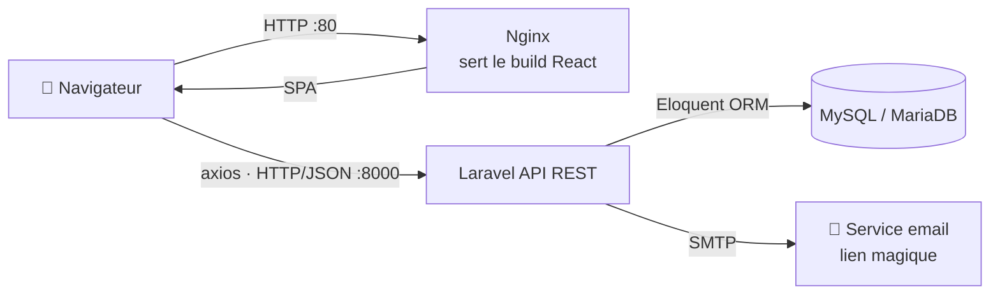

# 📋 Cahier des charges — Plateforme de gestion académique (Groupe 13)

> Document de spécifications fonctionnelles et techniques, établi à partir de l'analyse du **frontend (React)** et du **backend (Laravel)** existants.
> Référentiel base de données : voir [merise.md](./merise.md).

| | |
| --- | --- |
| **Projet** | Note Management G13 — suivi et gestion des notes académiques |
| **Type** | Application web (SPA + API REST) |
| **Version du document** | 1.0 |
| **Stack** | Laravel (API) · React + Vite (SPA) · MySQL/MariaDB · Nginx |

---

## 📑 Sommaire

1. [Présentation du projet](#1-présentation-du-projet)
2. [Objectifs du projet](#2-objectifs-du-projet)
3. [Périmètre du projet](#3-périmètre-du-projet)
4. [Acteurs et rôles](#4-acteurs-et-rôles)
5. [Besoins fonctionnels](#5-besoins-fonctionnels)
6. [Spécifications des écrans (Frontend)](#6-spécifications-des-écrans-frontend)
7. [Spécifications des API (Backend)](#7-spécifications-des-api-backend)
8. [Besoins non fonctionnels](#8-besoins-non-fonctionnels)
9. [Architecture technique](#9-architecture-technique)
10. [Modèle de données](#10-modèle-de-données)
11. [Contraintes et livrables](#11-contraintes-et-livrables)
12. [Glossaire](#12-glossaire)

---

## 1. Présentation du projet

La plateforme **Groupe 13** est une application web permettant à un étudiant de **saisir, organiser et suivre ses notes** tout au long de son cursus universitaire (système **LMD**).

L'utilisateur structure son parcours selon une hiérarchie :

```text
Année académique → Semestre → Module → Matière → Notes
```

Il peut ainsi **calculer ses moyennes** et avoir une vision claire de sa progression. L'authentification se fait **sans mot de passe** (connexion par lien magique envoyé par email).

L'application est composée de **deux parties indépendantes** :

- un **backend** Laravel exposant une **API REST** (données + authentification) ;
- un **frontend** React (SPA) consommant cette API via `axios`.

---

## 2. Objectifs du projet

| N° | Objectif |
| --- | --- |
| OBJ1 | Permettre la **gestion complète** de la structure académique (années, semestres, modules, matières). |
| OBJ2 | Permettre la **saisie et le suivi des notes** (examens, devoirs, contrôle continu). |
| OBJ3 | Offrir une **authentification simple et sécurisée** sans mot de passe (magic link). |
| OBJ4 | Garantir que **chaque utilisateur ne voie que ses propres données**. |
| OBJ5 | Proposer une interface **moderne, responsive et intuitive**. |

---

## 3. Périmètre du projet

### ✅ Inclus dans le périmètre

- Inscription et authentification par lien magique.
- CRUD complet : années académiques, semestres, modules, matières, notes.
- Réorganisation de l'ordre d'affichage (tri) des éléments.
- Saisie de notes libres / contrôle continu (colonnes N1 à N10).
- Espace d'administration personnel protégé.

### ❌ Hors périmètre (évolutions possibles)

- Gestion multi-utilisateurs partagée (enseignant ↔ élèves).
- Export PDF / impression des bulletins.
- Statistiques avancées et graphiques de progression.
- Application mobile native.
- Internationalisation (multilingue).

---

## 4. Acteurs et rôles

| Acteur | Description | Droits |
| --- | --- | --- |
| **Visiteur** | Internaute non connecté | Consulter la page d'accueil, s'inscrire, demander un lien de connexion |
| **Utilisateur authentifié** (étudiant) | Personne disposant d'un compte et connectée via Sanctum | Gérer **uniquement ses propres** années, semestres, modules, matières et notes |

> 🔒 Le système est **mono-rôle** : il n'existe pas de rôle administrateur global. Chaque utilisateur est administrateur de son propre espace.

---

## 5. Besoins fonctionnels

> Priorités (MoSCoW) : **I** = Indispensable · **S** = Souhaitable · **O** = Optionnel.

### 5.1 Authentification et compte

| ID | Besoin | Priorité |
| --- | --- | --- |
| RF1 | L'utilisateur peut **créer un compte** avec son nom complet et son email (email unique). | I |
| RF2 | L'utilisateur peut **demander un lien de connexion** en saisissant son email. | I |
| RF3 | Le système **envoie par email** un lien magique valable **15 minutes**, à **usage unique**. | I |
| RF4 | En cliquant sur le lien, l'utilisateur est **authentifié** et reçoit un **token Sanctum**. | I |
| RF5 | Un lien **expiré ou déjà utilisé** est refusé avec un message explicite. | I |
| RF6 | L'utilisateur peut se **déconnecter** (révocation du token courant). | I |

### 5.2 Gestion de la structure académique

| ID | Besoin | Priorité |
| --- | --- | --- |
| RF7 | Créer, renommer et supprimer une **année académique**. | I |
| RF8 | Créer, renommer et supprimer un **semestre** rattaché à une année. | I |
| RF9 | Créer, modifier et supprimer un **module** (avec nombre de crédits). | I |
| RF10 | Créer, renommer et supprimer une **matière** rattachée à un module. | I |
| RF11 | **Réordonner** semestres, modules, matières et notes (ordre d'affichage). | S |
| RF12 | La suppression d'un élément supprime **en cascade** ses éléments enfants. | I |

### 5.3 Gestion des notes

| ID | Besoin | Priorité |
| --- | --- | --- |
| RF13 | Ajouter une **note** à une matière (type, session, score décimal). | I |
| RF14 | Modifier et supprimer une note. | I |
| RF15 | Saisir des **notes libres** (contrôle continu, TD/TP — colonnes N1 à N10). | S |
| RF16 | Distinguer plusieurs **types** d'évaluation (devoir, examen…) et **sessions**. | S |

### 5.4 Consultation

| ID | Besoin | Priorité |
| --- | --- | --- |
| RF17 | Charger en **une seule requête** l'intégralité des données de l'utilisateur (`/user-full`). | I |
| RF18 | Afficher la structure complète : années → semestres → modules → matières → notes. | I |
| RF19 | Calculer / afficher les **moyennes** à partir des notes saisies. | S |

---

## 6. Spécifications des écrans (Frontend)

Application **SPA** React Router. Routes définies dans `App.jsx` :

| Route | Écran | Accès | Rôle |
| --- | --- | --- | --- |
| `/` | **Accueil** (`Home`) | Public | Présentation de la plateforme, accès connexion/inscription |
| `/register` | **Inscription** (`Register`) | Public | Création de compte (nom + email) |
| `/login` | **Connexion** (`Login`) | Public | Saisie email → envoi du lien magique |
| `/magic-link` | **Vérification** (`MagicLinkVerify`) | Public | Validation du token, stockage du token, redirection vers `/admin` |
| `/admin` | **Espace de gestion** (`Admin`) | **Protégé** (`ProtectedRoute`) | Tableau de bord complet : CRUD années/semestres/modules/matières/notes, moyennes, déconnexion |

### Exigences d'interface

- **Responsive** (mobile / tablette / desktop) via Tailwind CSS.
- Affichage d'un **loader** pendant les appels réseau (cf. `MagicLinkVerify`).
- Affichage de **messages d'erreur** clairs et localisés (français).
- Protection de la route `/admin` : redirection vers `/login` si non authentifié.
- Boîtes de dialogue d'ajout/édition (composants `hover/add/*`).

---

## 7. Spécifications des API (Backend)

API REST Laravel. Base : `http://127.0.0.1:8000/api`. Réponses au format **JSON**.
Les routes protégées exigent l'en-tête `Authorization: Bearer <token>` (middleware `auth:sanctum`).

### 7.1 Authentification (public)

| Méthode | Endpoint | Description |
| --- | --- | --- |
| `POST` | `/register` | Création de compte (`full_name`, `email`) |
| `POST` | `/auth/magic-link` | Génère et envoie le lien magique |
| `POST` | `/auth/magic-link/verify` | Vérifie le token et renvoie un token Sanctum |

### 7.2 Compte (protégé)

| Méthode | Endpoint | Description |
| --- | --- | --- |
| `POST` | `/logout` | Déconnexion (révoque le token courant) |
| `GET` | `/user` | Profil simple |
| `GET` | `/user-full` | Profil + toute l'arborescence des données |

### 7.3 Données académiques (protégé)

| Ressource | Ajouter | Modifier | Supprimer | Réordonner |
| --- | --- | --- | --- | --- |
| **Années** | `/add_academic_years` | `/mod_academic_years` | `/delete-academic-years` | — |
| **Semestres** | `/add_semester` | `/mod_semester` | `/delete_semester` | `/change_semester` |
| **Modules** | `/modules/add` | `/modules/update` | `/modules/delete` | `/modules/change-order` |
| **Matières** | `/subjects/add` | `/subjects/update` | `/subjects/delete` | `/subjects/change-order` |
| **Notes** | `/grades/add` | `/grades/update` | `/grades/delete` | `/grades/change-order` |

> ➕ Endpoint spécifique : `POST /grades/free` — saisie groupée des **notes libres** (N1 à N10).

### 7.4 Règles de validation (exemples)

- `register.email` : requis, format email, **unique**.
- `auth/magic-link.email` : requis, format email, **doit exister** en base.
- `verify.token` : requis ; rejeté si **introuvable** (422) ou **expiré** (422).

---

## 8. Besoins non fonctionnels

| Domaine | Exigence |
| --- | --- |
| **Sécurité** | Authentification par token **Sanctum** ; liens magiques **à usage unique** et **expirant (15 min)** ; validation systématique des entrées ; isolation des données par utilisateur ; HTTPS recommandé en production. |
| **Intégrité** | Contraintes de clés étrangères avec **`ON DELETE CASCADE`** sur toute la hiérarchie. |
| **Performance** | Chargement des données en **une requête** (eager loading `/user-full`) ; compression **gzip** et fichiers statiques servis par **Nginx**. |
| **Ergonomie (UX)** | Interface responsive, loaders, retours d'erreur explicites, navigation SPA fluide. |
| **Compatibilité** | Navigateurs modernes (Chrome, Firefox, Edge, Safari). |
| **Maintenabilité** | Séparation nette **front / back** ; backend en **couches** (routes → contrôleurs → modèles) ; code documenté. |
| **Portabilité** | Backend exécutable au choix sous serveur PHP/Laravel ; frontend buildé statiquement (déployable derrière Nginx). |

---

## 9. Architecture technique



### Stack technique

| Couche | Technologies |
| --- | --- |
| **Frontend** | React 19, Vite 8, React Router 7, Axios, Tailwind CSS 4 |
| **Backend** | PHP / Laravel, Laravel Sanctum (auth API), Eloquent ORM |
| **Base de données** | MySQL / MariaDB |
| **Serveur web** | Nginx (sert le build + fallback SPA) |
| **Emailing** | Mailable Laravel (`MagicLinkMail`) via SMTP |

---

## 10. Modèle de données

Le modèle suit une hiérarchie **1-N** stricte :

```text
USER (1,n) → ACADEMIC_YEAR (1,n) → SEMESTER (1,n) → MODULE (1,n) → SUBJECT (1,n) → GRADE
```

Une table technique `magic_link_tokens` gère les liens de connexion temporaires.

> 📐 La modélisation complète (dictionnaire des données, MCD, MLD, MPD, règles de gestion) est détaillée dans **[merise.md](./merise.md)**.

---

## 11. Contraintes et livrables

### Contraintes

- Le backend doit être accessible sur le **port 8000** (URL codée côté frontend : `BASE_URL`).
- La configuration **CORS** du backend doit autoriser l'origine du frontend.
- Un service **SMTP** valide est requis pour l'envoi des liens magiques.

### Livrables

| Livrable | Description |
| --- | --- |
| Code source backend | API Laravel (`backend/`) |
| Code source frontend | SPA React (`frontend/`) |
| Build de production | `frontend/dist/` déployé dans Nginx |
| Documentation | Fiche de révision, modélisation MERISE, présent cahier des charges (`docs/`) |

---

## 12. Glossaire

| Terme | Définition |
| --- | --- |
| **SPA** | *Single Page Application* — application web monopage (React). |
| **API REST** | Interface exposant des ressources via des URLs et verbes HTTP. |
| **Magic link** | Lien de connexion à usage unique envoyé par email (sans mot de passe). |
| **Sanctum** | Package Laravel d'authentification d'API par token. |
| **Eloquent** | ORM de Laravel (mapping objet ↔ tables). |
| **LMD** | *Licence-Master-Doctorat* — système universitaire structurant le cursus. |
| **CRUD** | *Create, Read, Update, Delete* — opérations de base sur les données. |

---

*Cahier des charges généré à partir de l'analyse du code source (frontend React + backend Laravel).* 📋
