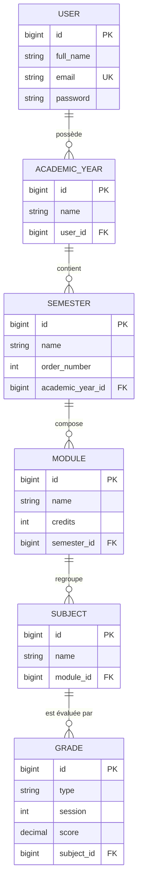

# 🗃️ MERISE — Modélisation de la base de données du projet

> Comment utiliser la méthode **MERISE** pour modéliser la base de données de ce backend Laravel.
> On part des **données réelles** (migrations + modèles Eloquent) et on remonte vers les 3 modèles de MERISE.

---

## 📑 Sommaire

1. [MERISE en bref](#1-merise-en-bref)
2. [La démarche en 4 étapes](#2-la-démarche-en-4-étapes)
3. [Étape 0 — Le dictionnaire des données](#3-étape-0--le-dictionnaire-des-données)
4. [Étape 1 — Le MCD (Modèle Conceptuel de Données)](#4-étape-1--le-mcd-modèle-conceptuel-de-données)
5. [Étape 2 — Le MLD (Modèle Logique de Données)](#5-étape-2--le-mld-modèle-logique-de-données)
6. [Étape 3 — Le MPD (Modèle Physique de Données)](#6-étape-3--le-mpd-modèle-physique-de-données)
7. [Les règles de gestion](#7-les-règles-de-gestion)
8. [Correspondance MERISE ↔ Laravel](#8-correspondance-merise--laravel)

---

## 1. MERISE en bref

**MERISE** est une **méthode française d'analyse et de conception** des systèmes d'information (années 1970-80). Son idée centrale : **séparer les DONNÉES des TRAITEMENTS**, et descendre par **niveaux d'abstraction** (du plus abstrait au plus concret).

Pour la partie **données** (celle qui nous intéresse ici), MERISE définit **3 modèles** :

| Modèle | Niveau | Question à laquelle il répond | Équivalent moderne |
| --- | --- | --- | --- |
| **MCD** | Conceptuel | *Quelles sont les entités et leurs liens ?* (indépendant de toute techno) | Diagramme Entité-Association (E-A) |
| **MLD** | Logique | *Comment ça se traduit en tables relationnelles ?* | Schéma relationnel (tables + clés) |
| **MPD** | Physique | *Comment ça s'écrit concrètement dans le SGBD ?* | `CREATE TABLE` SQL / migrations |

> 🧠 **À retenir** : MCD = idées, MLD = tables, MPD = SQL.
> Dans ce projet, le **MPD existe déjà** (ce sont tes migrations) — MERISE permet de **remonter** jusqu'au sens métier (MCD).

---

## 2. La démarche en 4 étapes

```text
Étape 0          Étape 1            Étape 2             Étape 3
Dictionnaire  →  MCD            →   MLD             →   MPD
des données      (entités +         (tables +           (types SQL +
                  associations)      clés étrangères)     contraintes)
```

Appliqué à ton backend, ça donne le découpage des sections suivantes.

---

## 3. Étape 0 — Le dictionnaire des données

On recense **toutes les données** manipulées, avec leur type et leurs contraintes. C'est la matière première du MCD.

### Entité USER (table `users`)

| Code | Désignation | Type | Contraintes |
| --- | --- | --- | --- |
| `id` | Identifiant | Entier | **Clé primaire**, auto-incrément |
| `full_name` | Nom complet | Chaîne (255) | Obligatoire |
| `email` | Adresse email | Chaîne (255) | Obligatoire, **unique** |
| `email_verified_at` | Date de vérification email | Date/heure | Nullable |
| `password` | Mot de passe (haché) | Chaîne (255) | Obligatoire |

### Entité ANNÉE ACADÉMIQUE (table `academic_years`)

| Code | Désignation | Type | Contraintes |
| --- | --- | --- | --- |
| `id` | Identifiant | Entier | **Clé primaire** |
| `name` | Libellé de l'année (ex. « 2025-2026 ») | Chaîne (255) | Obligatoire |
| `user_id` | Propriétaire | Entier | **Clé étrangère** → `users` |

### Entité SEMESTRE (table `semesters`)

| Code | Désignation | Type | Contraintes |
| --- | --- | --- | --- |
| `id` | Identifiant | Entier | **Clé primaire** |
| `name` | Libellé du semestre | Chaîne (255) | Obligatoire |
| `order_number` | Ordre d'affichage | Entier | Défaut `1` |
| `academic_year_id` | Année de rattachement | Entier | **Clé étrangère** → `academic_years` |

### Entité MODULE (table `modules`)

| Code | Désignation | Type | Contraintes |
| --- | --- | --- | --- |
| `id` | Identifiant | Entier | **Clé primaire** |
| `name` | Nom du module | Chaîne (255) | Obligatoire |
| `credits` | Crédits (ECTS) | Entier | Obligatoire |
| `order_number` | Ordre d'affichage | Entier | Défaut `1` |
| `semester_id` | Semestre de rattachement | Entier | **Clé étrangère** → `semesters` |

### Entité MATIÈRE (table `subjects`)

| Code | Désignation | Type | Contraintes |
| --- | --- | --- | --- |
| `id` | Identifiant | Entier | **Clé primaire** |
| `name` | Nom de la matière | Chaîne (255) | Obligatoire |
| `order_number` | Ordre d'affichage | Entier | Défaut `1` |
| `module_id` | Module de rattachement | Entier | **Clé étrangère** → `modules` |

### Entité NOTE (table `grades`)

| Code | Désignation | Type | Contraintes |
| --- | --- | --- | --- |
| `id` | Identifiant | Entier | **Clé primaire** |
| `type` | Type d'évaluation (devoir, examen…) | Chaîne (255) | Défaut `devoir` |
| `session` | N° de session | Entier | Défaut `1` |
| `score` | Note obtenue | Décimal (4,2) | Défaut `0` (ex. `15.50`) |
| `order_number` | Ordre d'affichage | Entier | Défaut `1` |
| `subject_id` | Matière concernée | Entier | **Clé étrangère** → `subjects` |

> 🔐 **Table à part — `magic_link_tokens`** (`id`, `email`, `token` unique, `expires_at`) : c'est une table **technique de sécurité** pour la connexion sans mot de passe. Elle n'est pas reliée par clé étrangère à `users` : elle est associée **par la valeur de l'email**.
>
> ⚙️ Les tables `sessions`, `cache`, `jobs`, `personal_access_tokens`, `password_reset_tokens` sont des tables **techniques du framework** Laravel — hors du modèle métier.

---

## 4. Étape 1 — Le MCD (Modèle Conceptuel de Données)

Le MCD décrit les **entités** (les « choses » métier) et les **associations** entre elles, **sans se soucier de la technique**. C'est le cœur de MERISE.

### Le schéma Entité-Association



### Les cardinalités (notation MERISE)

En MERISE, chaque patte d'association porte un couple **(min, max)** qui se lit *« une occurrence de cette entité participe au minimum… au maximum… fois »*.

```text
USER            (0,n) ──── POSSÈDE ────── (1,1)  ACADEMIC_YEAR
ACADEMIC_YEAR   (0,n) ──── CONTIENT ───── (1,1)  SEMESTER
SEMESTER        (0,n) ──── COMPOSE ─────── (1,1)  MODULE
MODULE          (0,n) ──── REGROUPE ────── (1,1)  SUBJECT
SUBJECT         (0,n) ──── ÉVALUE ──────── (1,1)  GRADE
```

**Comment lire la première ligne :**

- côté `USER` → **(0,n)** : un utilisateur peut posséder **0 à plusieurs** années académiques.
- côté `ACADEMIC_YEAR` → **(1,1)** : une année académique appartient à **exactement 1** utilisateur.

C'est le motif classique d'une relation **« un-à-plusieurs » (1-N)**, répété tout au long de la hiérarchie.

---

## 5. Étape 2 — Le MLD (Modèle Logique de Données)

On **traduit** le MCD en **schéma relationnel** (des tables). La règle est mécanique :

> 📏 **Règle de traduction d'une association 1-N** :
> la clé primaire du côté **« 1 »** (le parent) **descend** comme **clé étrangère** dans la table du côté **« plusieurs »** (l'enfant).
> Exemple : `USER.id` devient `academic_years.user_id`.

### Schéma relationnel

```text
Légende :  __clé primaire__       #clé_étrangère

USER            (__id__, full_name, email, email_verified_at, password)
ACADEMIC_YEAR   (__id__, name, #user_id)
SEMESTER        (__id__, name, order_number, #academic_year_id)
MODULE          (__id__, name, credits, order_number, #semester_id)
SUBJECT         (__id__, name, order_number, #module_id)
GRADE           (__id__, type, session, score, order_number, #subject_id)
MAGIC_LINK_TOKEN(__id__, email, token, expires_at)
```

Chaque flèche `1-N` du MCD est devenue **une colonne `#..._id`**. Aucune table d'association n'est nécessaire ici, car il n'y a **pas de relation N-N** (plusieurs-à-plusieurs) dans ce modèle.

---

## 6. Étape 3 — Le MPD (Modèle Physique de Données)

On précise les **types SQL réels** et les **contraintes** pour le SGBD (ici MySQL/MariaDB).
👉 **Dans ce projet, le MPD, ce sont tes migrations Laravel.**

### Correspondance type métier → type SQL

| Type (dictionnaire) | Type MySQL | Migration Laravel |
| --- | --- | --- |
| Identifiant | `BIGINT UNSIGNED AUTO_INCREMENT` | `$table->id()` |
| Chaîne | `VARCHAR(255)` | `$table->string('...')` |
| Entier | `INT` | `$table->integer('...')` |
| Décimal (4,2) | `DECIMAL(4,2)` | `$table->decimal('score', 4, 2)` |
| Date/heure | `TIMESTAMP` | `$table->timestamps()` |
| Clé étrangère | `BIGINT` + contrainte FK | `$table->foreignId('...')->constrained()` |

### Exemple : MPD de la table `grades`

```sql
CREATE TABLE grades (
    id           BIGINT UNSIGNED NOT NULL AUTO_INCREMENT,
    subject_id   BIGINT UNSIGNED NOT NULL,
    type         VARCHAR(255) NOT NULL DEFAULT 'devoir',
    session      INT NOT NULL DEFAULT 1,
    score        DECIMAL(4,2) NOT NULL DEFAULT 0,
    order_number INT NOT NULL DEFAULT 1,
    created_at   TIMESTAMP NULL,
    updated_at   TIMESTAMP NULL,
    PRIMARY KEY (id),
    CONSTRAINT fk_grades_subject
        FOREIGN KEY (subject_id) REFERENCES subjects(id)
        ON DELETE CASCADE
);
```

> 🔁 Le `ON DELETE CASCADE` (présent sur **toutes** tes clés étrangères) traduit une règle de gestion forte : *supprimer un parent supprime automatiquement tous ses enfants* (supprimer une année supprime ses semestres → modules → matières → notes).

---

## 7. Les règles de gestion

Les règles de gestion (RG) sont les **phrases métier** d'où découlent les cardinalités du MCD :

| N° | Règle de gestion |
| --- | --- |
| RG1 | Un utilisateur gère **plusieurs** années académiques ; une année appartient à **un seul** utilisateur. |
| RG2 | Une année académique se découpe en **plusieurs** semestres ; un semestre appartient à **une seule** année. |
| RG3 | Un semestre est composé de **plusieurs** modules ; un module appartient à **un seul** semestre. |
| RG4 | Un module regroupe **plusieurs** matières ; une matière appartient à **un seul** module. |
| RG5 | Une matière reçoit **plusieurs** notes ; une note concerne **une seule** matière. |
| RG6 | Un module porte un nombre de **crédits** (ECTS). |
| RG7 | Une note possède un **type** (devoir/examen), une **session** et un **score** (sur 20, à 2 décimales). |
| RG8 | La suppression d'un élément **supprime en cascade** tous ses descendants. |

---

## 8. Correspondance MERISE ↔ Laravel

Le tableau qui relie **chaque concept MERISE** à **ce que tu as écrit** dans le projet :

| Concept MERISE | Dans Laravel | Exemple du projet |
| --- | --- | --- |
| **Entité** | Un **Modèle** Eloquent | `App\Models\Grade` |
| **Attribut** | Une colonne (`$fillable`) | `score`, `type`, `session` |
| **Identifiant** | Clé primaire | `$table->id()` |
| **Association 1-N** | `hasMany` / `belongsTo` | `Subject::hasMany(Grade)` ↔ `Grade::belongsTo(Subject)` |
| **Clé étrangère** (MLD) | `foreignId()->constrained()` | `grades.subject_id` |
| **MPD** | Une **migration** | `..._grades.php` |
| **Contrainte d'intégrité** | `onDelete('cascade')` | sur chaque FK |

> ✅ **En résumé** : tu as construit le **MPD** (migrations) et les **entités** (modèles).
> MERISE te permet de **documenter le sens métier** par-dessus : MCD pour expliquer *quoi*, MLD pour montrer *les tables*, MPD pour le *SQL*.

---

*Document de modélisation MERISE — généré à partir de l'analyse du backend.* 📐
